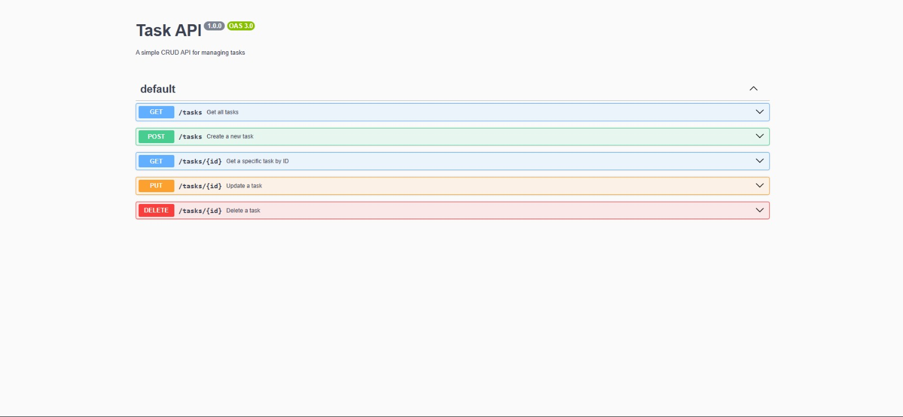

# BackEnd_CRUD

This repository has the code of the first backed CRUD that I created. It is a RESTful API built with Node.js and Express that allows users to manage a simple list of tasks.


### How to Install and Run
To install the dependencies and start the server, run this single command in your terminal:
```bash
npm install && node server.mjs


