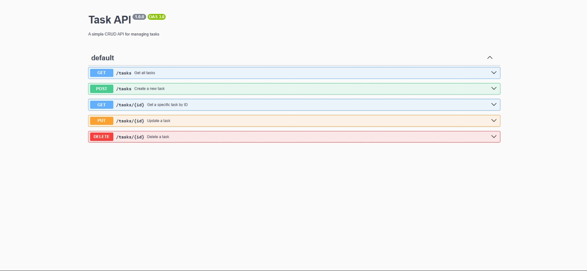

# BackEnd_CRUD

This repository has the code of the first backed CRUD that I created. It is a RESTful API built with Node.js and Express that allows users to manage a simple list of tasks.

### How to Install and Run
To install the dependencies and start the server, run this single command in your terminal:
\`\`\`bash
npm install && node server.mjs
\`\`\`

### SQLite Database Integration
This project uses **SQLite** for data storage. SQLite was chosen because it is a lightweight, single-file database that requires zero configuration and ensures that task data survives server restarts.

* **Database Location:** The data is stored in a file named `tasks.db`. This file is created automatically the first time the application runs. It is included in `.gitignore` so that anyone cloning this repository starts with a fresh, empty database.
* **Direct Database Query:** During development, I tested the database directly using the query `SELECT * FROM tasks WHERE done = 1;`. This successfully returned a list of all tasks that were marked as completed.

### Database View
Below is a view of the `tasks.db` file opened directly in DB Browser for SQLite:

